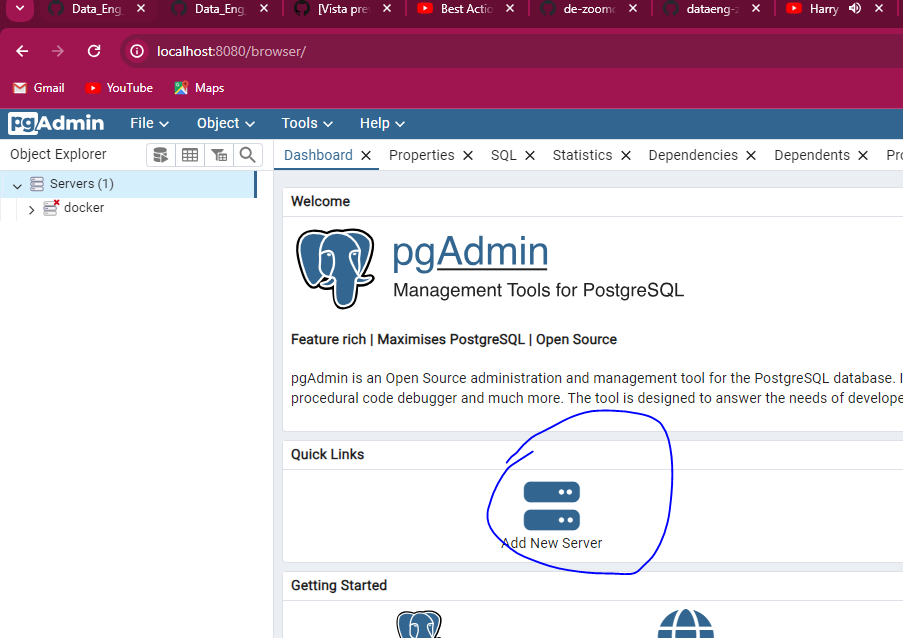
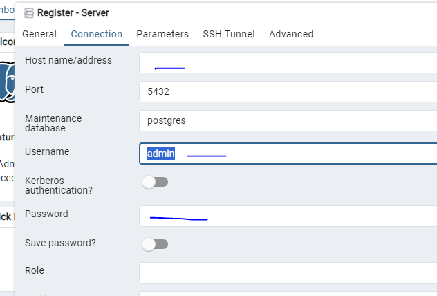

## Running Postgres in a container 

Create a folder anywhere you'd like for Postgres to store data in. We will use the example folder ny_taxi_postgres_data. Here's how to run the container:
```bash
docker run -it \
    -e POSTGRES_USER="root" \
    -e POSTGRES_PASSWORD="root" \
    -e POSTGRES_DB="ny_taxi" \
    -v $(pwd)/ny_taxi_postgres_data:/var/lib/postgresql/data \
    -p 5432:5432 \
    postgres:13
```
* The container needs 3 environment variables:
    * `POSTGRES_USER` is the username for logging into the database. We chose `root`.
    * `POSTGRES_PASSWORD` is the password for the database. We chose `root`
        * ***IMPORTANT: These values are only meant for testing. Please change them for any serious project.***
    * `POSTGRES_DB` is the name that we will give the database. We chose `ny_taxi`.
* `-v` points to the volume directory. The colon `:` separates the first part (path to the folder in the host computer) from the second part (path to the folder inside the container).
    * Path names must be absolute. If you're in a UNIX-like system, you can use `pwd` to print you local folder as a shortcut; this example should work with both `bash` and `zsh` shells, but `fish` will require you to remove the `$`.
    * This command will only work if you run it from a directory which contains the `ny_taxi_postgres_data` subdirectory you created above.
* The `-p` is for port mapping. We map the default Postgres port to the same port in the host.
* The last argument is the image name and tag. We run the official `postgres` image on its version `13`.

Once the container is running, we can log into our database with [pgcli](https://www.pgcli.com/) with the following command:
```bash
pgcli -h localhost -p 5432 -u root -d ny_taxi
```
* `-h` is the host. Since we're running locally we can use `localhost`.
* `-p` is the port.
* `-u` is the username.
* `-d` is the database name.
* The password is not provided; it will be requested after running the command.

## Ingesting data to Postgres using python

_([Video source](https://www.youtube.com/watch?v=2JM-ziJt0WI&list=PL3MmuxUbc_hJed7dXYoJw8DoCuVHhGEQb&index=4))_

We will now create a Jupyter Notebook [Project.ipynb ](https://github.com/cesarc780/Data_Eng_2024/blob/main/Docker-Terraform/Project.ipynb) file which we will use to read a the Parquet file, transfrom it and  export it to Postgres.

We will use data from the [NYC TLC Trip Record Data website](https://www1.nyc.gov/site/tlc/about/tlc-trip-record-data.page). and we will take the data from January 2021 "Yellow Taxi Trip Records" Since the format is Parquet we require to transform it to csv in order to make the code work

To check that the data was sucessfully loaded to the database , we access the database and run the code \dt to check the tables in the database, we can also create a little query to check further 

## Conecting pgAdmin and Postgres
_([Video source](https://www.youtube.com/watch?v=hCAIVe9N0ow&list=PL3MmuxUbc_hJed7dXYoJw8DoCuVHhGEQb&index=7))_

pgcli is a good to acess the database. However, in order to acess it with a visual tool we may want to use pgAdmin.

To do so, we require to connect the ports for the pgAdmin and database.

Let's create a virtual Docker network called `pg-network`:

```bash
docker network create pg-network
```
We will now re-run our Postgres container with the added network name and the container network name, so that the pgAdmin container can find it (we'll use `pg-database` for the container name):

```bash
docker run -it \
    -e POSTGRES_USER="root" \
    -e POSTGRES_PASSWORD="root" \
    -e POSTGRES_DB="ny_taxi" \
    -v $(pwd)/ny_taxi_postgres_data:/var/lib/postgresql/data \
    -p 5432:5432 \
    --network=pg-network \
    --name pg-database \
    postgres:13
```

We will now run the pgAdmin container on another terminal:
```bash
docker run -it \
    -e PGADMIN_DEFAULT_EMAIL="admin@admin.com" \
    -e PGADMIN_DEFAULT_PASSWORD="root" \
    -p 8080:80 \
    --network=pg-network \
    --name pgadmin \
    dpage/pgadmin4
```
* The container needs 2 environment variables: a login email and a password. We use `admin@admin.com` and `root` in this example.
 * ***IMPORTANT: these are example values for testing and should never be used on production. Change them accordingly when needed.***
* pgAdmin is a web app and its default port is 80; we map it to 8080 i n our localhost to avoid any possible conflicts.
* Just like with the Postgres container, we specify a network and a name. However, the name in this example isn't really necessary because there won't be any containers trying to access this particular container.
* The actual image name is `dpage/pgadmin4` .

You should now be able to load pgAdmin on a web browser by browsing to `localhost:8080`. Use the same email and password you used for running the container to log in.



Here use pg-database as name, and make sure to have the container with the port 5432 active


